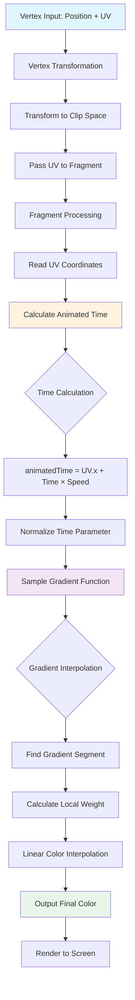
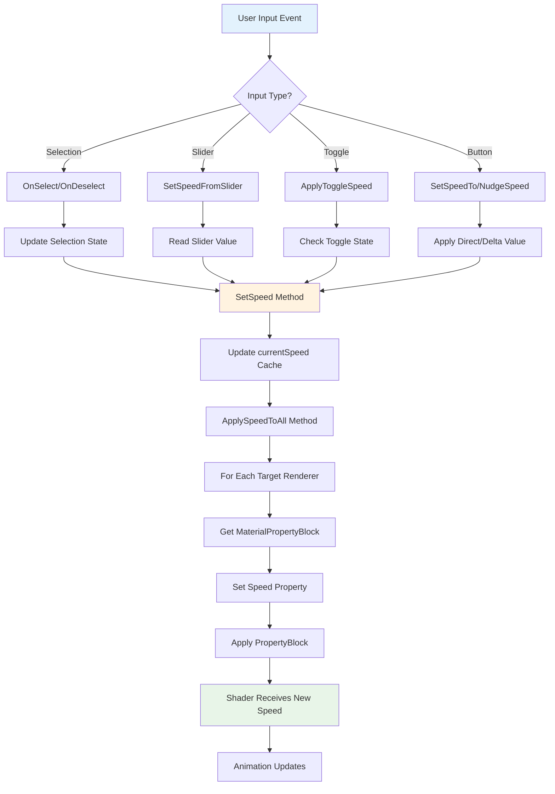

# Unity Hello World Shader Documentation

## 1. Theoretical Background & Concepts

### 1.1 Mathematical Foundation
This shader implements a **time-animated gradient mapping** using UV parametric coordinates and temporal functions. The core mathematical principle relies on **1D texture coordinate interpolation** combined with **temporal displacement**.

**Key Concepts:**
- **UV Coordinate System**: 2D parametric space (u,v) ∈ [0,1]² mapping 3D surface to 2D texture space
- **Gradient Interpolation**: Piecewise linear color interpolation across normalized parameter space
- **Temporal Animation**: Time-based coordinate transformation for dynamic visual effects
- **Color Space Operations**: RGB color blending using linear interpolation (LERP)

### 1.2 Graphics Pipeline Integration
The shader operates within Unity's **Universal Render Pipeline (URP)**, utilizing:
- **Vertex Stage**: Transform object coordinates to clip space, pass UV coordinates
- **Fragment Stage**: Per-pixel color calculation using interpolated UV coordinates
- **Property System**: Uniform variable management for real-time parameter control

### 1.3 Aesthetic Design Decisions
- **Rainbow Gradient**: Full spectrum color transition (Red → Yellow → Blue → Red) for maximum visual impact
- **Horizontal Animation**: U-coordinate based movement for intuitive left-to-right flow
- **Continuous Loop**: Seamless color cycling using modular arithmetic
- **Parametric Control**: Exposed speed parameter for user customization

---

## 2. Mathematical Functions & Models

### 2.1 Core Mathematical Functions

#### **Gradient Sampling Function**
```hlsl
half4 SampleGradient(Gradient gradient, float time)
```
**Purpose**: Maps normalized time parameter [0,1] to RGB color space using piecewise linear interpolation.

**Mathematical Model**:
```
f(t) = lerp(C₀, C₁, w) where:
- t ∈ [0,1] (normalized time parameter)  
- Cᵢ = color at keyframe i
- w = local interpolation weight within segment
```

**Example**: For t = 0.5 between Red(1,0,0) at t=0.33 and Blue(0,0,1) at t=0.66:
```
w = (0.5 - 0.33) / (0.66 - 0.33) = 0.515
Result = lerp((1,0,0), (0,0,1), 0.515) = (0.485, 0, 0.515)
```

#### **Temporal Displacement Function**
```hlsl
float animatedTime = uv.x + (_Time.y * _Speed)
```
**Purpose**: Creates moving wave effect by shifting UV coordinates over time.

**Mathematical Model**:
```
T(u,t) = u + v·t where:
- u = UV horizontal coordinate [0,1]
- t = elapsed time (seconds)
- v = velocity parameter (Speed)
- T = transformed coordinate for gradient sampling
```

**Reasoning**: Linear time progression ensures constant animation speed and seamless looping when T wraps around [0,1].

#### **Color Gradient Definition**
**Keyframe Structure**:
- **t=0.0**: Red (1,0,0) - Start/End point for seamless loop
- **t=0.33**: Yellow (1,1,0) - Primary-secondary color transition  
- **t=0.66**: Blue (0,0,1) - Cool color region
- **t=1.0**: Red (1,0,0) - Loop closure

**Reasoning**: Uneven spacing creates natural color flow following color theory principles.

### 2.2 Coordinate Transformation Pipeline

#### **Vertex Transformation**
```hlsl
output.positionCS = TransformObjectToHClip(input.positionOS.xyz)
```
**Mathematical Model**: Composite transformation matrix
```
P_clip = M_projection × M_view × M_model × P_object
```

#### **UV Coordinate Passing**
```hlsl
output.uv = input.uv
```
**Purpose**: Preserve parametric surface coordinates for fragment stage interpolation.

---

## 3. Algorithm Flow Chart

### 3.1 Complete Shader Pipeline



### 3.2 Gradient Sampling Algorithm

```mermaid
flowchart TD
    A[Input: time parameter t] --> B{t < 0.33?}
    B -->|Yes| C[Segment 1: Red → Yellow]
    B -->|No| D{t < 0.66?}
    
    C --> E[weight = t / 0.33]
    E --> F[color = lerp(Red, Yellow, weight)]
    
    D -->|Yes| G[Segment 2: Yellow → Blue]
    D -->|No| H[Segment 3: Blue → Red]
    
    G --> I[weight = (t - 0.33) / 0.33]
    I --> J[color = lerp(Yellow, Blue, weight)]
    
    H --> K[weight = (t - 0.66) / 0.34]
    K --> L[color = lerp(Blue, Red, weight)]
    
    F --> M[Return Color]
    J --> M
    L --> M
    
    style A fill:#e3f2fd
    style M fill:#e8f5e8
```

### 3.3 Animation Loop Logic

```mermaid
flowchart TD
    A[Frame Start] --> B[Read System Time]
    B --> C[Multiply by Speed Parameter]
    C --> D[Add to UV.x coordinate]
    D --> E{Result > 1.0?}
    
    E -->|Yes| F[Apply Modulo Operation]
    E -->|No| G[Use Direct Value]
    
    F --> H[time = fmod(result, 1.0)]
    G --> H
    H --> I[Sample Gradient at time]
    I --> J[Display Color]
    J --> K[Next Frame]
    K --> A
    
    style A fill:#fff3e0
    style I fill:#f3e5f5
    style J fill:#e8f5e8
```

## Technical Specifications

**Shader Type**: Unlit Surface Shader (URP)  
**Render Queue**: Geometry (2000)  
**Lighting Model**: Unlit (no lighting calculations)  
**Platform Support**: All Unity-supported platforms  
**Performance**: Optimized for real-time rendering (O(1) per pixel)

**Property Parameters**:
- `Speed`: Float [0.0, 2.0] - Animation velocity multiplier
- `Gradient`: Color gradient definition with 4 keyframes

---

## 4. Interactive UI Controller System

### 4.1 SelectedHelper Component Architecture

The `SelectedHelper` script provides real-time shader parameter control through Unity's UI system. This component bridges user interaction and shader property manipulation using **MaterialPropertyBlock** for efficient rendering.

#### **Core Functionality**
```csharp
public class SelectedHelper : MonoBehaviour, ISelectHandler, IDeselectHandler
```

**Design Pattern**: **Observer Pattern** implementation using Unity Events and EventSystem integration.

**Key Components**:
- **Selection State Management**: Binary state tracking with automatic UI synchronization
- **Shader Property Control**: Dynamic parameter modification without material duplication
- **Event-Driven Architecture**: UnityEvent system for extensible behavior attachment

### 4.2 Mathematical Control Functions

#### **Speed Interpolation System**
```csharp
public void SetSpeed(float value)
{
    currentSpeed = value;
    ApplySpeedToAll(currentSpeed);
}
```

**Mathematical Model**:
```
S(t) = S_base + Δt where:
- S_base = baseline speed value
- Δt = user input delta (slider, nudge, etc.)
- S(t) = resulting animation speed parameter
```

#### **State-Based Speed Control**
```csharp
Select() → SetSpeed(speedOnSelect)
Deselect() → SetSpeed(speedOnDeselect)
```

**Transition Function**:
```
f(state) = {
    speedOnSelect    if state = SELECTED
    speedOnDeselect  if state = DESELECTED
}
```

### 4.3 UI Integration Patterns

#### **Slider Control Integration**
```csharp
public void SetSpeedFromSlider(Slider slider)
```
**Use Case**: Continuous speed control with real-time feedback
**Range**: [0.0, 5.0] typical for smooth animation control

#### **Toggle Control Integration**  
```csharp
public void ApplyToggleSpeed(Toggle toggle)
```
**Binary State Mapping**:
```
Speed = toggle.isOn ? toggleOnSpeed : toggleOffSpeed
```

#### **Button/Event Integration**
```csharp
public void SetSpeedTo(float value)    // Direct value setting
public void NudgeSpeed(float delta)    // Relative adjustment
```

### 4.4 Performance Optimization Strategy

#### **MaterialPropertyBlock Usage**
```csharp
private void ApplySpeedToAll(float value)
{
    r.GetPropertyBlock(_mpb);
    _mpb.SetFloat(_speedID, value);
    r.SetPropertyBlock(_mpb);
}
```

**Performance Benefits**:
- **Memory Efficiency**: Avoids material instantiation (saves GPU memory)
- **Batch Compatibility**: Maintains draw call batching when possible  
- **Runtime Optimization**: O(1) property update per renderer

**Mathematical Advantage**: Single property modification instead of full material copy:
```
Memory_usage = N_materials × Material_size (traditional)
vs.
Memory_usage = 1_material + N_renderers × PropertyBlock_size (optimized)
```

### 4.5 Component Integration Flowchart



**File Structure** (Updated):
```
Assets/
├── Shaders/
│   ├── HelloWorldShader.shadergraph
│   └── HelloWorldMaterial.mat
├── Scripts/
│   └── SelectedHelper.cs
├── UI/
│   ├── Canvas prefabs
│   └── UI control elements
└── Scenes/
    └── ShaderHelloWorld.unity
```
